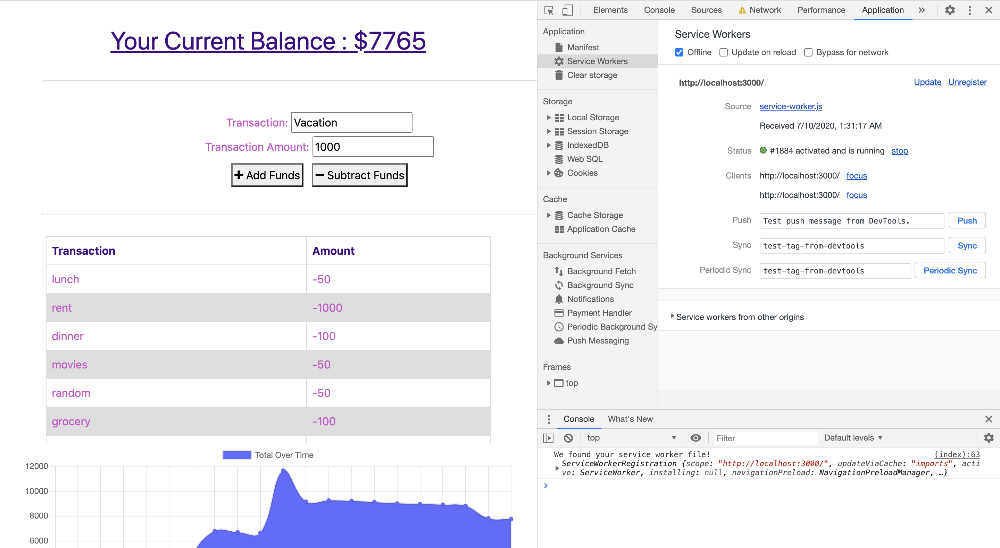
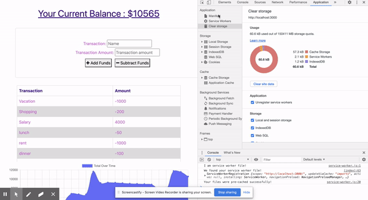

# PWA : Online/Offline Budget Trackers

## Table of Contents

### [Introduction](##intro)
### [UserStory](##userStory)
### [Installation](##installation)
### [Screenshots](##screenshots)
### [GIF](##gif)
### [Questions](##questions)

## Introduction

This is my first attempt at PWA (Progressive Web App) which allows users to access basic functionality of an application OFFLINE ! Isn't that cool ? Well this is a very simple app that keeps a track of a user's expenses and if a user has made some changes while offline, it saves it in indexDB(browser's DB) and when the user comes back online will update it on the server.

## User Story

As an avid traveller I want to be able to track my withdrawals and deposits with or without a data/internet connection so that my account balance is accurate when I am traveling or when i do not have internet.

## Installation

To install necessary dependencies, run the following command:

* express
* mongoose
* indexDB
* Cache Storage
* --Install using 'npm i--

## Screenshots

#### Making changes while offline

## GIF

#### GIF demonstration

## Questions

If you have any questions drop by at [SabahSyedGitHubProfile](https://github.com/sabahsyed)
[SabahSyedLinkedInProfile](https://www.linkedin.com/in/sabah-syed-89a07344/)
t
